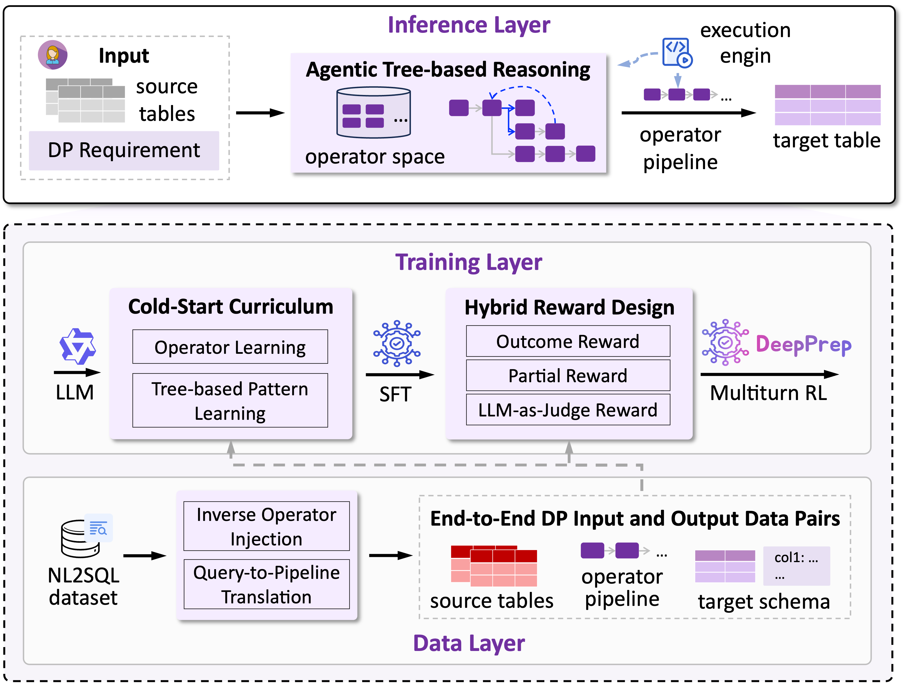

#  DeepPrep: An LLM-Powered Agentic System for Autonomous Data Preparation

[](https://arxiv.org/abs/2602.07371)
[](https://www.vldb.org/pvldb/)
[](https://github.com/ruc-datalab/DeepPrep)
[](https://huggingface.co/datasets/RUC-DataLab/DP-Synthesized)

> **📄 Paper**: This work is published at **PVLDB 2026** (Volume 19, Issue 1).

**DeepPrep** is an LLM-powered agentic system designed for **Autonomous Data Preparation (ADP)**. It transforms heterogeneous and noisy raw tables into analysis-ready data based on high-level natural language specifications.

Unlike traditional linear interaction methods (e.g., ReAct) that struggle with error propagation, DeepPrep introduces a **Tree-based Agentic Reasoning** framework. This allows the system to explore, backtrack, and revise decisions based on intermediate execution feedback.

## ✨ Key Features

- 🌲 **Tree-Based Agentic Reasoning**: Organizes pipeline construction as a search tree. The agent iteratively performs `<plan>`, `<expand>`, and `<execute>` actions, enabling **non-local backtracking** when downstream execution fails.
- 🧠 **Progressive Agentic Training**: A novel training framework combining:
  - **Cold-Start Curriculum**: Initializes the model with operator syntax and reasoning procedures.
  - **Multi-turn RL with Hybrid Reward**: Optimizes the policy using outcome correctness, partial progress, and process-level rewards.
- 🔄 **Execution-Grounded Environment**: Maintains materialized intermediate table states and provides rich runtime feedback (e.g., error traces, data samples) to guide the agent.
- 🚀 **High Performance & Low Cost**: DeepPrep achieves accuracy comparable to **GPT-5** at **15× lower inference cost**.
- 🛠 **Comprehensive Operator Support**: Supports 31+ operators covering cleaning, joining, aggregation, reshaping, and Python code synthesis.

<p align="center" width="100%">

</p>

## 📊 Performance

DeepPrep establishes state-of-the-art performance among open-source baselines and rivals proprietary models.

### Datasets
We evaluate on three datasets:
| Dataset | Train | Test | Pipeline Length | # Op Types |
| :--- | :---: | :---: | :---: | :---: |
| **Synth-Spider** (In-domain) | 6,788 | 2,908 | 1-28 | 31 |
| **Synth-Bird** (Out-of-domain) | 782 | 1,135 | 2-25 | 31 |
| **Parrot** | 13,965 | 1,365 | 1-17 | 17 |

### Main Results

**Synth-Spider & Synth-Bird**

| Method | Backbone | Synth-Spider Acc | Synth-Spider Comp | Synth-Bird Acc | Synth-Bird Comp |
| :--- | :--- | :---: | :---: | :---: | :---: |
| **DeepPrep (Ours)** | **Qwen3-14B** | **67.18** | **76.54%** | **54.09** | **62.67%** |
| **DeepPrep (Ours)** | **Qwen3-8B** | **65.99** | **75.65%** | **53.39** | **61.76%** |
| ReAct | GPT-5 | 67.03 | - | - | - |
| ReAct | Qwen3-14B | 40.39 | - | 16.04 | - |
| CodeGen | Qwen3-14B | 45.47 | - | 29.48 | - |
| AutoPrep | Qwen3-14B | 36.75 | - | 10.41 | - |

**Parrot**

| Method | Backbone | Parrot Acc | Parrot Comp |
| :--- | :--- | :---: | :---: |
| **DeepPrep (Ours)** | **Qwen3-14B** | **97.46%** | **99.34%** |
| **DeepPrep (Ours)** | **Qwen3-8B** | **95.39%** | **98.43%** |

> **Key Findings**:
> 1. DeepPrep achieves accuracy **comparable to GPT-5** at **15× lower inference cost**
> 2. DeepPrep generalizes well to **out-of-domain** datasets (Synth-Bird)
> 3. Model scaling improves performance: Qwen3-14B outperforms Qwen3-8B across all benchmarks

## 📁 Project Structure

- `app/`: Execution Environment (Sandbox) handling table states and operator execution.
- `chatapp/`: Interactive web interface for ADP tasks.
- `_config/`: Configuration files.
- `src/`: Core implementation of Tree-based Agentic Reasoning and RL training.
- `data_synthesis/`: Scripts for generating `Synth-Spider` and `Synth-Bird` datasets.

## 🚀 Quick Start

### 1. Setup

#### 1.1 Environment Installation

```bash
conda create -n deepprep python==3.11.11
conda activate deepprep
pip install -r requirements.txt
```

#### 1.2 Dataset Download

Download the synthesized datasets (`Synth-Spider`, `Synth-Bird`) from our [Hugging Face repository](https://huggingface.co/fmh1art/DeepPrep_Dataset) and extract them.

#### 1.3 Configuration

1. **Base Config**: Update `_config/base_config.yaml`:
   - `openai_base_url`: URL for your LLM inference server (e.g., vLLM).
   - `nl2sql_data_root`: Path to the downloaded datasets.

2. **API Keys**: Add keys to `/_keys/keys.txt` if using proprietary models or authenticated endpoints.

3. **Model Config**: Create/Edit a config file (e.g., `_config/deepprep_qwen3_14b.yaml`):

   ```yaml
   agent_max_err_cnt: 5
   execute_mode: rule # or 'code' for python execution
   framework: tree_search # Enables Tree-based Agentic Reasoning
   llm_name: Qwen/Qwen2.5-14B-Instruct # or your local model path
   max_explore_turn: 5
   ```

### 2. Usage

#### Run Evaluation

To evaluate DeepPrep on the benchmark datasets:

```bash
python example/mulprocess_eval/main.py \
  --cfg deepprep_qwen3_14b \
  --benchmark synth-spider \
  --split test \
  --n 8
```

#### Interactive Demo

Launch the web UI to interact with DeepPrep:

1. Start the backend server (see [App README](/app/README.md)).
2. Start the frontend (see [ChatApp README](/chatapp/README.md)).

## 🦁 Model Zoo

We release a comprehensive suite of trained models ranging from 0.5B to 14B parameters, based on **Qwen2.5** and **Qwen3**.

| Model | Parameters | Base Model | Link |
| :--- | :---: | :--- | :---: |
| **DeepPrep-Qwen3-14B** | 14B | Qwen3-14B | [🤗 HuggingFace](https://huggingface.co/DeepPrep/DeepPrep-Qwen3-14B) |
| **DeepPrep-Qwen3-8B** | 8B | Qwen3-8B | [🤗 HuggingFace](https://huggingface.co/DeepPrep/DeepPrep-Qwen3-8B) |
| DeepPrep-Qwen3-4B | 4B | Qwen3-4B | [🤗 HuggingFace](https://huggingface.co/DeepPrep/DeepPrep-Qwen3-4B) |
| DeepPrep-Qwen3-1.7B | 1.7B | Qwen3-1.7B | [🤗 HuggingFace](https://huggingface.co/DeepPrep/DeepPrep-Qwen3-1.7B) |
| DeepPrep-Qwen3-0.6B | 0.6B | Qwen3-0.6B | [🤗 HuggingFace](https://huggingface.co/DeepPrep/DeepPrep-Qwen3-0.6B) |
| **DeepPrep-Qwen2.5-14B** | 14B | Qwen2.5-14B | [🤗 HuggingFace](https://huggingface.co/DeepPrep/DeepPrep-Qwen2.5-14B) |
| DeepPrep-Qwen2.5-7B | 7B | Qwen2.5-7B | [🤗 HuggingFace](https://huggingface.co/DeepPrep/DeepPrep-Qwen2.5-7B) |
| DeepPrep-Qwen2.5-3B | 3B | Qwen2.5-3B | [🤗 HuggingFace](https://huggingface.co/DeepPrep/DeepPrep-Qwen2.5-3B) |
| DeepPrep-Qwen2.5-1.5B | 1.5B | Qwen2.5-1.5B | [🤗 HuggingFace](https://huggingface.co/DeepPrep/DeepPrep-Qwen2.5-1.5B) |
| DeepPrep-Qwen2.5-0.5B | 0.5B | Qwen2.5-0.5B | [🤗 HuggingFace](https://huggingface.co/DeepPrep/DeepPrep-Qwen2.5-0.5B) |

## 🖋 Citation

If you find DeepPrep useful for your research, please cite our work:

```bibtex
@article{fan2026deepprep,
  title={DEEPPREP: An LLM-Powered Agentic System for Autonomous Data Preparation},
  author={Fan, Meihao and Fan, Ju and Zhang, Yuxin and Zhang, Shaolei and Du, Xiaoyong and Song, Jie and Li, Peng and Jiang, Fuxin and Zhang, Tieying and Chen, Jianjun},
  journal={PVLDB},
  volume={19},
  number={1},
  year={2026}
}
```

PVLDB Reference Format:
> Meihao Fan, Ju Fan, Yuxin Zhang, Shaolei Zhang, Xiaoyong Du, Jie Song, Peng Li, Fuxin Jiang, Tieying Zhang, Jianjun Chen. 2026. DEEPPREP: An LLM-Powered Agentic System for Autonomous Data Preparation. PVLDB, 19(1): XXX-XXX.
> DOI: https://doi.org/XXX-XXX-XX

## 🤝 Acknowledgements

We thank the developers of **Qwen**, **Spider**, and **BIRD** for their open-source contributions which facilitated this research.
